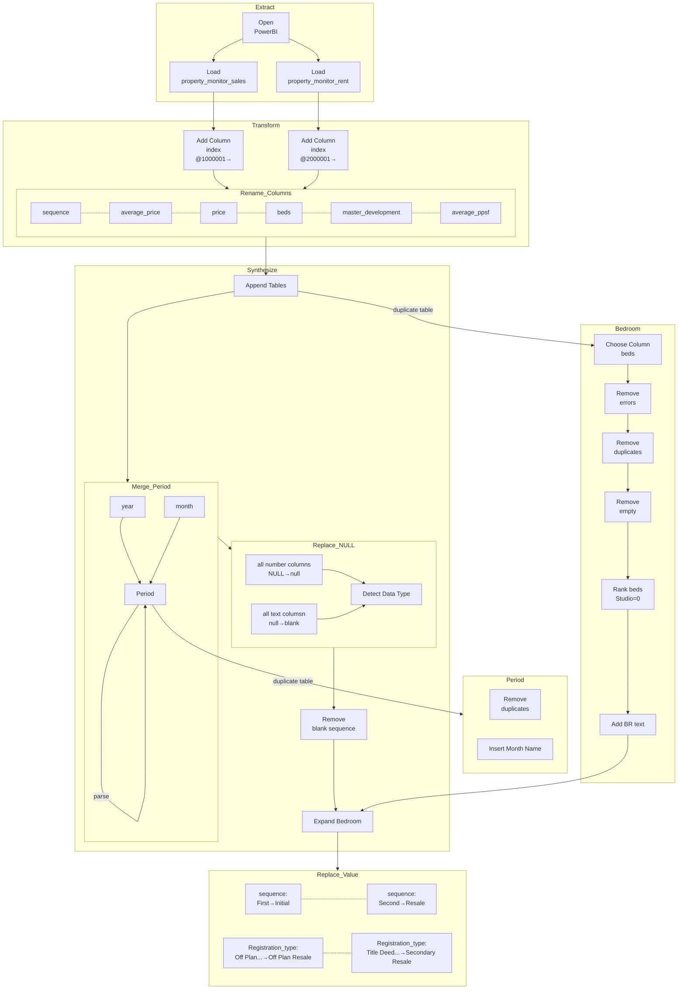

---
aliases:
  - 2024 Community Report Diagram
📁:
  - 🔀
🔀:
  - "1"
📅: 2024/12/18
🔢: 
🛡️:
  - 🔀
---
# #🔀 Process Diagram

```mermaid
graph

subgraph Extract
open[Open<br>PowerBI]
-->
loads[Load<br>property_monitor_sales] & loadr[Load<br>property_monitor_rent]
end

subgraph Transform
indexs[Add Column<br>index<br>@1000001→] & indexr[Add Column<br>index<br>@2000001→]
-->
Rename_Columns
end

loads-->indexs
loadr-->indexr

subgraph Rename_Columns
sequence
-.-average_price
-.-price
-.-beds
-.-master_development
-.-average_ppsf
end

Rename_Columns-->append

subgraph Synthesize
append[Append Tables]
-->Merge_Period
-->Replace_NULL
-->filter[Remove<br>blank sequence]
-->merge_bed[Expand Bedroom]
end

append-->|duplicate table|bed
addbr-->merge_bed
-->Replace_Value

subgraph Merge_Period
year & month
-->
P1[Period]
-->|parse|P1
end

P1-->|duplicate table|Period

subgraph Period
rem[Remove<br>duplicates]
ins[Insert Month Name]
end

subgraph Replace_NULL
nums[all number columns<br>NULL→null] & abcs[all text columsn<br>null→blank]
-->data[Detect Data Type]
end

subgraph Bedroom
bed[Choose Column<br>beds]
-->err[Remove<br>errors]
-->dup[Remove<br>duplicates]
-->emp[Remove<br>empty]
-->map[Rank beds<br>Studio=0]
-->addbr[Add BR text]
end

subgraph Replace_Value
first[sequence:<br>First→Initial]
-.-sec[sequence:<br>Second→Resale]
off[Registration_type:<br>Off Plan...→Off Plan Resale]
-.-title[Registration_type:<br>Title Deed...→Secondary Resale]
end
```

^2024-community-report-diagram