---
aliases:
  - MVCVM Diagram
📁:
  - 🔀
🔀:
  - "1"
📅: 2025/01/01
🔢:
  - 🧠
🛡️:
  - 🧜‍♂️
---
# #🔀 MVCVM Diagram

```mermaid
flowchart LR

A[model 📦]
B[view 🖼️]
C[control 🎛️]
D[vector 🔀]
E[matrix 🔢]

D-->|personalizing 👤|B
B-->|styling 🎨|A

A-->|utilizing ⚙️|C
C-->|tracking 📅|D
C-->|interfacing ⌨️|A
D-->|configuring ⤴️|C
D-->|learning 🎓|E
E-->|remembering 🧠|D
```

> [!a] the matrix is a small language model that trains on and updates the vector by tracking the user controls which then modify the model and generatively renders it in the view