---
aliases:
  - Data Analytics Certification Module 2
📁:
  - 🎓
🎓:
  - 🔢
  - 🟦
📅: 2024/12/30
⭕: ⭕
🔢: "2"
---
# #🎓 Data Analytics Certification Module 2

## #🔢 Data Analysis Steps

> [!qq] Define the problem and confirm stakeholder expectations
> # Ask

> [!x] Collect and store data for analysis
> # Prepare

> [!ww] Clean and transform data to ensure integrity
> # Process

> [!a] Use data analysis tools to draw conclusions
> # Analyze

> [!wer] Interpret and communicate results to others to make data-driven decisions
> # Share

> [!q] Put your insights to work in order to solve the original problem
> # Act

## #🔀 Data Life Cycle

```mermaid
graph

subgraph Plan
a{{what kind of data is needed}}-->
aa{{how it will be managed}}-->
aaa{{who will be responsible for it}}
end

subgraph Capture
b[(collect data from different sources)]
end

subgraph Manage
c([care for]) & cm([maintain]) --> data-->ss[storage]-->how & where-->ct[tools]
end

subgraph Analyze
d[[solve problems]]-->dm[[make decisions]]-->ds[[support business goals]]
end

subgraph Archive
k[(Keep)]
end

subgraph Destroy
f[/Remove from storage/]
g[/delete any shared copy/]
end

Plan-->Capture-->Manage-->Analyze-->ee{is data relevant?}-->|✅|Archive
ee-->|⭕|Destroy
```



## Life Cycle #⚔️ Analysis Process

```
Data life cycle is composed of the stages in which data analysis takes place. While the life cycle and the analysis process differ in the specifics, some stages of the former coincide with the latter. Data life cycle details what to do with the data itself while data analysis process elaborates what to do with the data to make decisions.
```

## #🔤 Glossary

- **Database:** A collection of data stored in a computer system
- **Formula:** A set of instructions used to perform a calculation using the data in a spreadsheet
- **Function:** A preset command that automatically performs a specified process or task using the data in a spreadsheet
- **Query:** A request for data or information from a database
- **Query language:** A computer programming language used to communicate with a database
- **Stakeholders:** People who invest time and resources into a project and are interested in its outcome
- **Structured Query Language:** A computer programming language used to communicate with a database
- **Spreadsheet:** A digital worksheet
- **SQL:** (Refer to Structured Query Language)