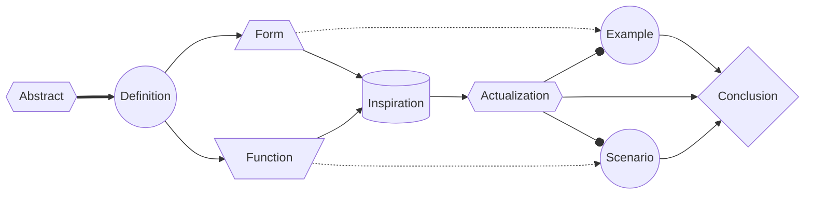

---
aliases:
  - Idea Flow
ðŸ“:
  - 🔀
🔀:
  - "1"
📅: 2024/12/22
🔢: "1"
🛡ï¸:
  - 🧜â€â™‚ï¸
  - 🧠
---
# #🔀 Idea Flow

```mermaid
flowchart LR
id0{{Abstract}}==>id1((Definition))
id1-->A2[/Form\]
id1-->A1[\Function/]
A1-->nid1[(Inspiration)]
A2-.->ee1((Example))
A2-->nid1
nid1-->id9{{Actualization}}
id9 --o ee1
id9-->ii{Conclusion}
A1-.->ee2((Scenario))
id9 --o ee2
ee2-->ii
ee1-->ii
```

^Idea-Flow